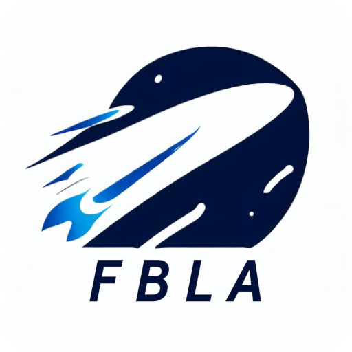

  **Current Status of Website**
   
   
  

   
   
  
  

# [FBLA Website](https://marionville-fbla.netlify.app/)

This FBLA website empowers us to communicate with our members and our community about our projects and goals. This website was made possible by the Hugo theme [Academic](https://github.com/wowchemy/starter-hugo-academic).

<b>Menu's and Topics on Website:</b>
1. [About](https://marionville-fbla.netlify.app/#about)
2. [Newsletter](https://marionville-fbla.netlify.app/#newsletter)
3. [Events](https://marionville-fbla.netlify.app/#events)
4. [Posts](https://marionville-fbla.netlify.app/#posts)
5. [Projects](https://marionville-fbla.netlify.app/#projects)
6. [Gallery](https://marionville-fbla.netlify.app/#gallery)
7. [Contact](https://marionville-fbla.netlify.app/#contact)

 

## Wowchemy Acknowledgements:

### [❤️ Click here to become a GitHub Sponsor for Wowchemy Academic!](https://github.com/sponsors/gcushen)

### - [Link for Wowchemy Academic Module](https://github.com/wowchemy/starter-hugo-academic)

 

## Latest News From Hugo-Academic-Modules

<!--START_SECTION:news-->
* [Easily make an academic CV website to get more cites and grow your audience 🚀](https:&#x2F;&#x2F;wowchemy.com&#x2F;blog&#x2F;easily-make-academic-website&#x2F;)
* [What&#39;s new in v5.2?](https:&#x2F;&#x2F;wowchemy.com&#x2F;blog&#x2F;whats-new-in-v5.2&#x2F;)
* [What&#39;s new in v5.1?](https:&#x2F;&#x2F;wowchemy.com&#x2F;blog&#x2F;whats-new-in-v5.1&#x2F;)
* [Version 5.0 (February 2021)](https:&#x2F;&#x2F;wowchemy.com&#x2F;blog&#x2F;version-5.0-february-2021&#x2F;)
* [Version 5.0 Beta 3 (February 2021)](https:&#x2F;&#x2F;wowchemy.com&#x2F;blog&#x2F;version-5.0-beta-3-february-2021&#x2F;)
<!--END_SECTION:news-->
