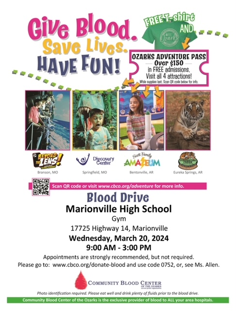

When you donate, you receive a free T-shirt and a chance to win a free gift card!

Sign-up with the link here:

[Blood Drive Sign-up Form](https://docs.google.com/forms/d/e/1FAIpQLSfMAssBKPDTrmjtrzYzh7P41FzrHvB_iBCaxB45kUlCf9_qAQ/viewform?usp=sf_link)

